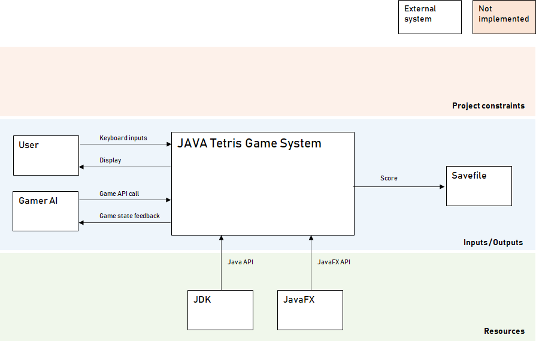
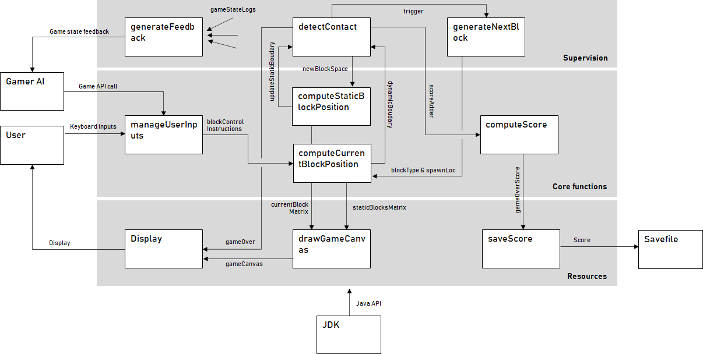

# JavaTetris

## Project purpose
Small tetris-like game project to get along with the specificities of Java

## Installation
Install JUnit & JavaFX dependencies using maven
For openJDK version < 11, JavaFX is still included.
For openJDK version 14 (and maybe up) I had to point to the JavaFX library downloaded from 
Gluon : https://gluonhq.com/products/javafx/

## Usage
Click on the start button to play the game. use the left and right arrow keys to steer the descent of the
current block. 
Press the down arrow key to accelerate the descent.
Press the CTRL key to rotate the block

## Support

## System Architecture

### Operational considerations

#### Use cases
The main use case for this project is actually to allow me to get some basic 
knowledge of Java.
The use case of the game have been listed bellow. The ones marked with a * are high 
value, prioritary use cases: Their implementation is required for the first release.
- Start a game*
- Play the game:
    - rotate elements*
    - speed up element fall*
    - win the level and proceed to the next one
- let an AI play the game in your stead    
- check the score*
- save the score (scoreboard) after a loss
- Exit:
    - Exit the current game (no save)
    - Exit the program*

#### System's context
Below is the context (environment) diagram of the game system. It highlights the
exchanges the system (represented as a black box) has with the outside.

### Functional considerations
This section regroups the behaviors which are expected to be followed by the 
game system in order to meet the use cases.
The following diagram illustrates the systems functions (that will be implemented 
through JAVA classes and the interactions between these functions.

### Logical considerations
This section regroups the software classes, objects and methods which are required in order
to implement the functions.

### Technical considerations
The GUI framework is javafx. JavaFX is not included anymore in
the latest versions of the openJDK and could cause library import difficulties ... 
It could have been wiser to use swing instead.
Apart from that only standard Java libs are used.
This is a simple project and there is no particular technical implementation nor deployment particularities
