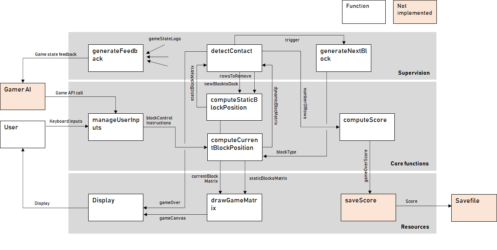

# JavaTetris

## Project purpose
Small tetris-like game project to get along with the specificities of Java

## Installation
Install JUnit & JavaFX dependencies using maven
For openJDK version < 11, JavaFX is still included.
For openJDK version 14 (and maybe up) I had to point to the JavaFX library downloaded from 
Gluon : https://gluonhq.com/products/javafx/

## Usage
Click on the start button to play the game. use the left and right arrow keys to steer the descent of the
current block. 
Press the down arrow key to accelerate the descent.
Press the CTRL key to rotate the block
The game speed is fixed.
When the blocks reach the top of the screen, the game is over.

## Support

## System Architecture

### Operational considerations

#### Use cases
The main use case for this project is actually to allow me to get some basic 
knowledge of Java.
The use case of the game have been listed bellow. The ones marked with a * are high 
value, prioritary use cases: Their implementation is required for the first release.
- Start a game*
- Play the game:
    - rotate elements*
    - speed up element fall*
    - win the level and proceed to the next one
- let an AI play the game in your stead    
- check the score*
- save the score (scoreboard) after a loss
- Exit:
    - Exit the current game (no save)
    - Exit the program*

#### System's context
Below is the context (environment) diagram of the game system. It highlights the
exchanges the system (represented as a black box) has with the outside.

### Functional considerations
This section regroups the behaviors which are expected to be followed by the 
game system in order to meet the use cases.
The principle is the following: 

- There are 2 matrices which dimensions correspond to the screen size. The current block matrix
corresponds to the position of the cells of the current block within the screen. The second is the
representation of all cells occupied by static (docked) blocks.

- At each time tick, the current block is forced down, this forced descent
is combined with user (keyboard) inputs allowing to move the current block
 right or left, to make it rotate or to accelerate its descent
 
- Each clock tick or user action cause the current block matrix to be computed again, fused 
 with the static blocks matrix, and displayed

- When a block reaches the bottom of the screen, or the top boundary of the static block
stack, it is docked and added to the static blocks matrix. 

- If a line is completed, it disappears from the screen, and the score is updated. 
Several lines (up to 4) can be completed at the same time.
The score is computed in accordance with standard Tetris rules.

- When one of the cell of the static blocks matrix is filled at the top of the screen, 
the game is over.
 
The following diagram illustrates the systems functions (that will be implemented 
through JAVA classes and the interactions between these functions. The functions highlighted
in orange corresponds to future use cases and have not been implemented as of now.

### Logical considerations
This section regroups the software classes, objects and methods which are required in order
to implement the functions. The implementation has been designed to stick - as much as possible - with the Model View 
Controller (MVC) pattern.
The following diagram represents the classes which are implemented in Java. The classes highlighed in orange
correspond to future use cases and have not been coded as of now.

### Technical considerations
The GUI framework is javafx. JavaFX is not included anymore in
the latest versions of the openJDK and could cause library import difficulties ... 
It could have been wiser to use swing instead.
Apart from that only standard Java libs are used.
This is a simple project and there is no particular technical implementation nor deployment particularities
