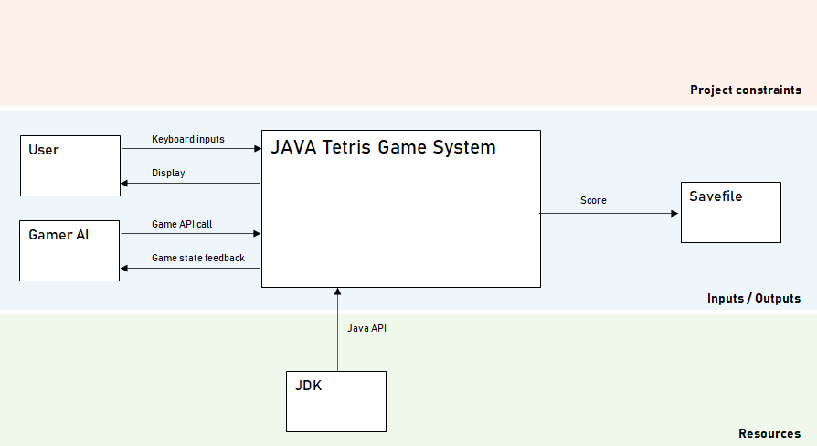
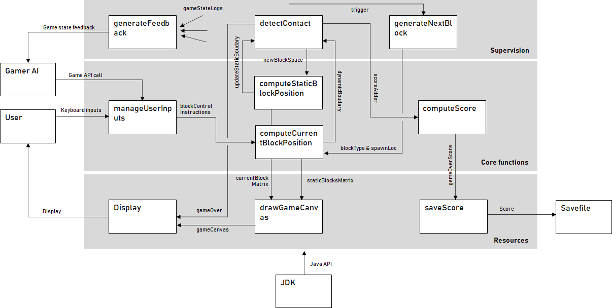

# JavaTetris

## Project purpose
Small tetris-like game project to get along with the specificities of Java

## Installation

## Usage

## Support

## System Architecture

### Operational considerations

#### Use cases
The main use case for this project is actually to allow me to get some basic 
knowledge of Java.
The use case of the game have been listed bellow. The ones marked with a * are high 
value, prioritary use cases: Their implementation is required for the first release.
- Start a game*
- Play the game:
    - rotate elements*
    - speed up element fall
    - win the level and proceed to the next one
- Watch the score*
- Save the score (scoreboard)*
- Exit:
    - Exit the current game (no save)
    - Exit the program*

#### System's context
Below is the context (environment) diagram of the game system. It highlights the
exchanges the system (represented as a black box) has with the outside.

### Functional considerations
This section regroups the behaviors which are expected to be followed by the 
game system in order to meet the use cases.
The following diagram illustrates the systems functions (that will be implemented 
through JAVA classes and the interactions between these functions.

### Technical considerations
This section regroups the software components which are required in order
to implement the functions.
